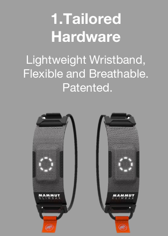
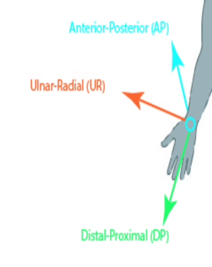
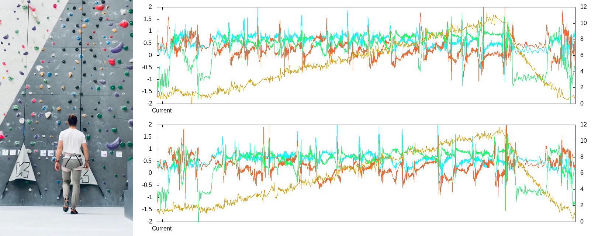
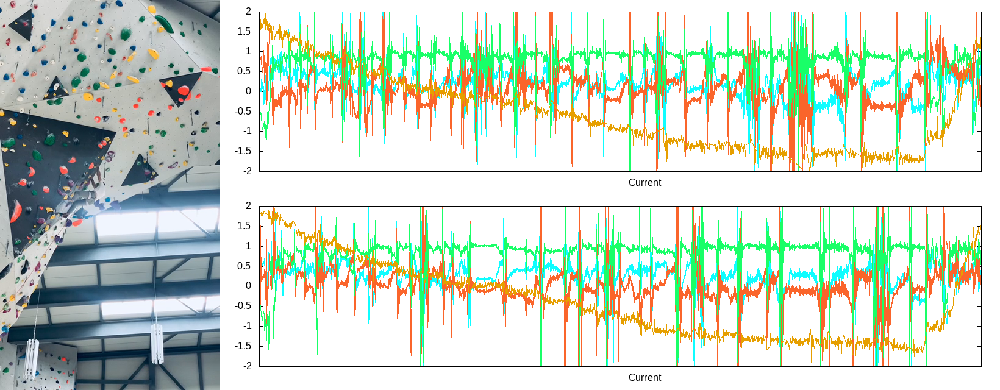
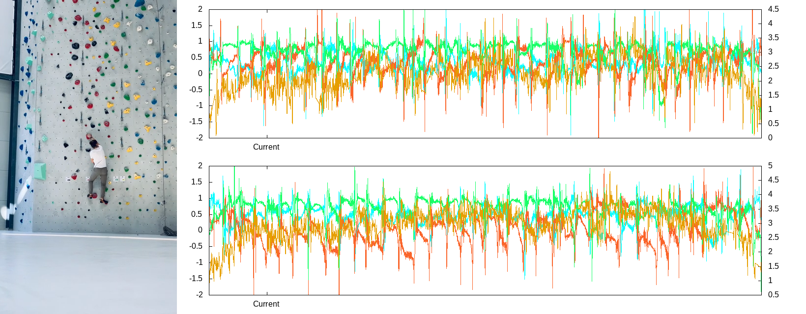

# Climbax

# NoML

In the age of data we take a revolutionary approach. We show to our
user the RAW sensors data, our extensive research demonstrated that
the user can easily interpreted it. Advantages

- no unreliable, unrepeatable intermediate between our devise and the user
- treat the user with respect, no "spoon-feeding"
- the user known exactly what our device is doing, it encourages trust for our products
- no expensive and fragile infrastructure
- fits the brand: explored nature without barriers

# Video

 

 

 

# Software

# Dependencies

shell, python (numpy, h5py), gnuplot, ffmpeg